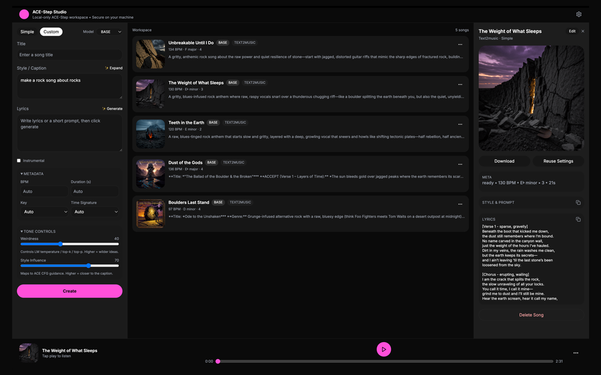

# ACE-Step Studio

Local-first Suno-style music studio powered by ACE-Step 1.5.

ACE-Step Studio uses:
- FastAPI backend for generation orchestration, model/runtime config, and API routes
- React + Vite frontend with one-page create/library/player workflow
- SQLite + filesystem storage for song metadata, audio, and cover assets
- Optional OpenAI-compatible endpoint support for prompt, lyrics, and title generation
- Optional local/remote cover-art generation providers (Fal, ComfyUI, A1111)

This project is designed for personal/self-hosted use and can run on macOS and Windows.

## Screenshot



## Installation

See the full step-by-step setup guide here: [docs/installation.md](./docs/installation.md)

## Repository Layout

```text
.
├── backend/        # FastAPI app, ACE-Step + LM services
├── docs/           # project docs and screenshots
├── frontend/       # Vite/React SPA (Suno-inspired UI)
├── scripts/        # install & start helpers
└── README.md
```

## Quick Start

## Quick Start

### Local Installation (Linux/macOS)
```bash
# Installs uv, python 3.11, torch, and application dependencies
./scripts/install.sh

# Start app
./scripts/start.sh
```

### Local Installation (Windows)
```powershell
# Installs uv, python 3.11, torch, and application dependencies
./scripts/install_windows.ps1

# Start app
./scripts/start.bat
```

### Docker
```bash
docker build -t ace-step-studio .
docker run --gpus all -p 8788:8788 -p 5175:5175 -p 8080:8080 -v $(pwd)/data:/workspace/data ace-step-studio
```

### RunPod / Cloud
See the [RunPod Deployment Guide](docs/RUNPOD-HOWTO.md).

Default ports:
- Backend: `8788`
- Frontend: `5175`

Port `8000` is intentionally avoided.

## Configuration Highlights

- `ACE_STEP_HOST` — bind address (set to your Tailscale IP to restrict access)
- `ACE_STEP_PORT` / `ACE_STEP_UI_PORT` — backend/frontend ports
- `ACE_STEP_ACE_REPO_PATH` / `ACE_STEP_CHECKPOINTS_PATH` — ACE repo and checkpoints locations
- `ACE_STEP_OPENAI_ENABLED` + `ACE_STEP_OPENAI_ENDPOINT` — OpenAI-compatible endpoint for prompt/lyrics/title tasks
- Filesystem storage rooted under `data/` (SQLite DB, runtime config, media folders)

Future ACE-Step modes (lego/extract/complete) already have UI placeholders to keep layout stable when the backend grows.
